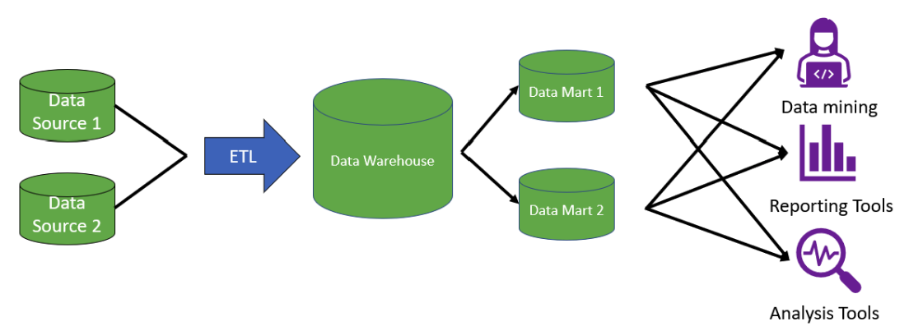

# Data Warehouse

## Top-Down

Cuando se tienen varias fuentes de datos y se pasan a un Data Warehouse con todos los datos y luego se divide en varios Data Marts para que estos ultimos sean consultados por los usuarios o herramientas finales:

## Bottom-Up(Kimball)

Cuando se tienen varias fuentes de datos y se transforman en varios Data Marts directamente y luego de estos se genera el Data Warehouse:

## 4 Pasos de Kimball

1. Identificación del proceso de negocio.
2. Establecer el nivel de granularidad mas pequeño.
3. Elegir las dimensiones y los atributos.
4. Identificar las métricas y los hechos.
