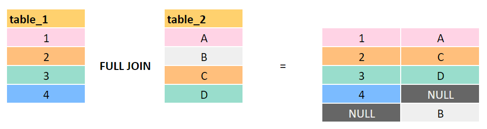
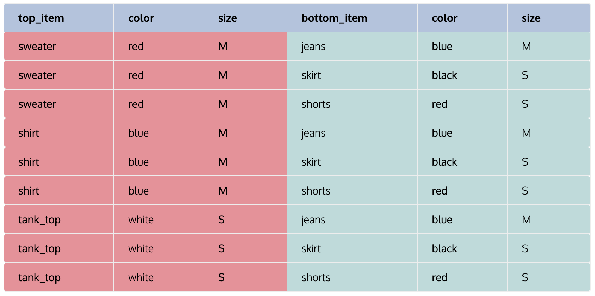

# Queries

## Orden Logico de las Operaciones

Orden| Sentencia           |  Propósito
-----|---------------------|---------------
1    | FROM                |  Trae los datos de las tablas.
2    | WHERE               |  Filtra las filas.
3    | GROUP BY            |  Agrupa las filas en categorias.
4    | SUM(), COUNT(), ... |  Realiza las operaciones de agregación.
5    | SELECT              |  Selecciona las columnas a regresar.
6    | DISTINCT            |  Elimina los duplicados.
7    | ORDER BY            |  Ordena los resultados.
8    | LIMIT               |  Limita la cantidad de filas a regresar.

## COUNT()
- Cuenta la cantidad de valores en el campo especificado, NO cuenta los valores NULL.
- Cuando se usa * se cuentan las filas.
- Cuando se usa el DISTINCT cuenta los distintos valores del campo especificado.

## USING
Se usa en los joins cuando el campo de comparación o union tiene el mismo nombre en las dos tablas, es decir:
```sql
SELECT field1, field2, field3
FROM table1 AS t1
    INNER JOIN table2 AS t2 ON t1.field_code = t2.field_code;

-- Se podría escribir como:

SELECT field1, field2, field3
FROM table1 AS t1
    INNER JOIN table2 AS t2 USING(field_code);
```

Ya que el campo de comparación se llama igual en ambas tablas.

## FULL JOIN
Cuando se necesita hacer un JOIN donde hay match en la tabla de la derecha o izquierda dadas las keys del JOIN, es como la union de un LEFT JOIN y un RIGHT JOIN, es decir:




## CROSS JOIN
Se utiliza para obtener todas las combinaciones entre los datos de las dos tablas, así:


## Tops CROSS JOIN Bottoms:


## UNION
Une dos grupos de datos, en caso de haber registros repetidos se eliminan y solo se muestran los registros únicos. En el resultado se utilizan los nombres de los campos del primer SELECT. Los campos a unir deben ser del mismo tipo de dato.


## UNION ALL
Une los dos grupos de datos incluyendo los duplicados. En el resultado se utilizan los nombres de los campos del primer SELECT. Los campos a unir deben ser del mismo tipo de dato.


## INTERSECT
Obtiene la intersección de las dos tablas, es decir, solo retornara los valores que sean iguales en ambas tablas sin duplicar. En el resultado se utilizan los nombres de los campos del primer SELECT. Los campos a unir deben ser del mismo tipo de dato.


## EXCEPT
Obtiene los valores de la primer tabla que NO estan en la segunda tabla. En el resultado se utilizan los nombres de los campos del primer SELECT. Los campos a unir deben ser del mismo tipo de dato.


## CROSSTAB
Permite crear filas en columnas.

Requiere extensión ```tablefunc``` en PostgreSQL:
```sql
CREATE EXTENSION IF NOT EXISTS tablefunc;
```
producto    |  region    |  total_ventas
------------|------------|---------------
Camiseta    |  Norte     |  100
Camiseta    |  Sur       |  150
Pantalón    |  Norte     |  200
Pantalón    |  Sur       |  300

```sql
SELECT * FROM crosstab(
    'SELECT producto, region, total_ventas FROM ventas ORDER BY 1, 2',
    'SELECT DISTINCT region FROM ventas ORDER BY 1'
) AS ct (
    producto TEXT,
    norte INT,
    sur INT
);
```

producto    |  norte  |  sur
------------|---------|------
Camiseta    |   100   |  150
Pantalón    |   200   |  300


## Common Table Expressions (CTE)
Son definiciones de una tabla temporal para ser usada en una consulta, se utiliza para simplificar el uso de sub-consultas:
```sql
WITH cte_name_1 AS (
    SELECT *
    FROM table_name_1
), cte_name_2 AS (
    SELECT *
    FROM table_name_2
)
SELECT *
FROM table_n
    INNER JOIN cte_name_1 AS cte_1 ON cte_1.field_id = table_n.field_id
    INNER JOIN cte_name_2 AS cte_2 ON cte_2.field_id = table_n.field_id;
```

## CASE en el WHERE
Se puede usar la sentencia CASE en el where para validar una condición, se debe colocar toda la sentencia CASE sin el alias.

## STRING_AGG(column, separator)
Permite convertir una columna en una lista para comprimir el resultado.

## Arrays
Se pueden crear columnas de tipo array usando [ ].
```sql
CREATE TABLE(
    id INTEGER,
    amounts INTEGER[], -- Array of integers
    emails TEXT[][]
);
```

Para consultar se puede buscar usando el indice de la columna del array a consultar.

## ANY
Se usa para buscar en cualquier columna del array.
```sql
SELECT *
FROM table_name
WHERE value = ANY(array_column);
```

También se puede usar el operador @> en vez del ANY.
